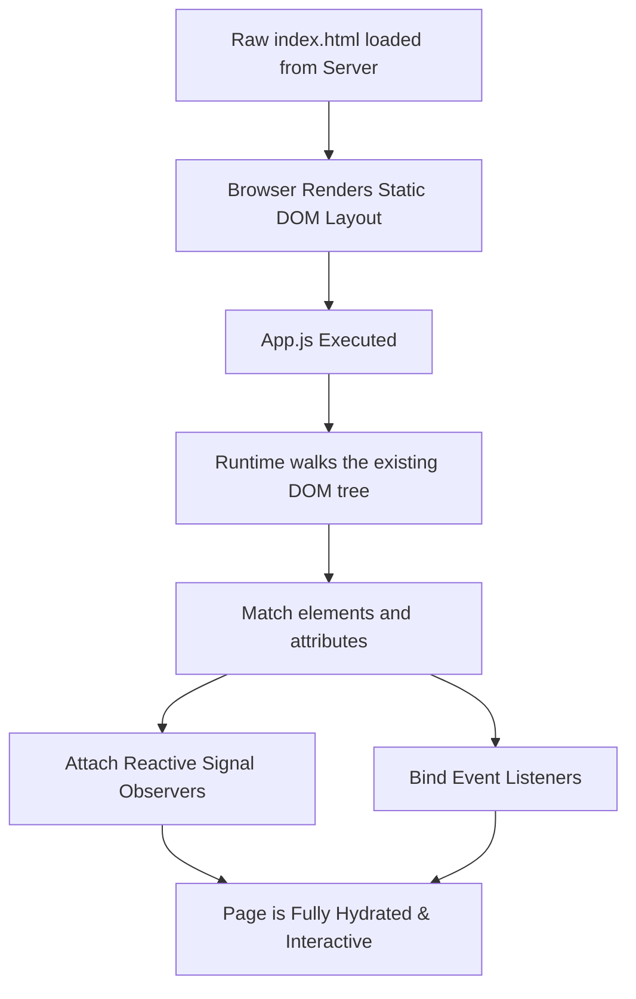

# OmniJS Hydration and SSR Specification

OmniJS utilizes a **Full Hydration** architecture to achieve optimal SEO indexability and immediate visual rendering without sacrificing client-side dynamic interactivity. Rather than shipping a blank HTML shell and constructing the DOM dynamically (standard Client-Side Rendering), or tearing down and recreating static DOM nodes on the client (partial/clunky hydration), OmniJS uses an intelligent compiler-assisted, tree-walking hydration strategy.

---

## 1. SSR / Build Pre-Rendering Strategy

During the AOT (Ahead-of-Time) compilation and build step, the OmniJS CLI parses and optimizes application assets.

1. **Semantic HTML Pre-generation**: The AOT compiler evaluates the structure of the root components and pre-generates semantic HTML structures.
2. **`index.html` Injection**: The built-in templates insert these semantic HTML structures directly into the `index.html` within the target mounting element (typically `#omni-root`), ensuring search engines (Googlebot, Bingbot, etc.) instantly see a fully formed document body.
3. **No-JS Compatibility**: Users with Javascript disabled or slow network connections receive the pre-rendered layout immediately.

---

## 2. Client-Side Hydration Walkthrough

When the browser loads the page:

1. The static HTML is displayed instantly.
2. The bundled javascript (`App.js`) loads and executes `mount(document.getElementById('omni-root'))`.
3. The runtime walks the pre-existing DOM tree instead of rendering new elements from scratch, attaching reactivity in-place.

### Step 2.1: Element Matching

The compiler transforms custom semantic elements into standard HTML5 equivalents (e.g., `<Stack>` to `<main>` or `
`). During hydration, the runtime traverses the DOM hierarchy child-by-child, matching elements with the AST compiled structure.

### Step 2.2: Event Listener Attachment

For every dynamic attribute like `on-click="handler"`, the runtime hooks directly into the existing DOM element using standard `addEventListener`. No nodes are replaced or modified during listener binding.

### Step 2.3: Reactive Signal Bindings

Properties mapped to signals (such as `bind-text="?count"` or `bind-class="?theme"`) are bound using `effect()` context wrappers.

- **Text Bindings**: When a signal value updates, only the text node's `.textContent` property is mutated.
- **Two-way Bindings**: Form inputs with `bind-value` are bound with an `input` listener to update the source signal, while an `effect` ensures any state mutation is immediately written back to the input element.
- **Structural Lists (Collections)**: Collections with `bind::data` and `as` parameters reactively spawn or prune child elements as arrays resize, using simple fragment diffing.

---

## 3. Benefits of Full Hydration in OmniJS

- **SEO Optimal**: 100% crawlable page contents. Search engines do not need to wait for JS execution to parse meta details, headings, and semantic outlines.
- **Zero-Flicker Bootup**: Since the HTML matches the initial client state exactly, the hydration process runs silently without triggering visible DOM repaints or layout shifts.
- **Tiny Bundle Overhead**: Because the hydration runtime shares code directly with the main renderer, the total bundle size remains exceptionally light (under 17 KB minified).
